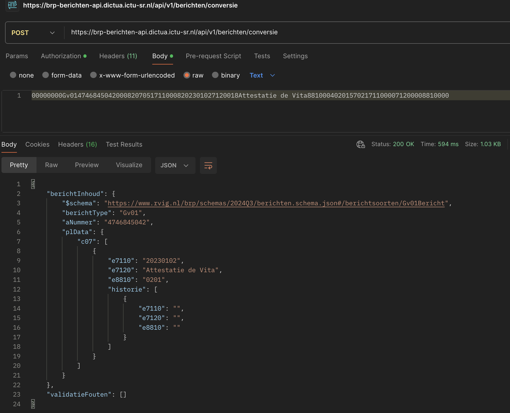

# BRP Berichten API

Deze repository bevat de OpenAPI Specificatie van de BRP Berichten API en andere informatie over deze voorziening voor
berichtuitwisseling, zoals het JSON Schema voor persoonsgegevens.

## Uitgangspunten voor de BRP Berichten API

- Qua berichtuitwisseling en berichtcycli dicht blijven bij het Logisch Ontwerp BRP.
- Berichtuitwisseling via RESTful API.
- Berichtinhoud in JSON.
- Text-encoding UTF-8.

## JSON & JSON-Schema's

De berichtuitwisseling en de data daarmee daadwerkelijk mee uitgewisseld wordt zal via JSON genoteerd worden. Om te
duiden hoe deze data gestructureerd dient te worden zijn verschillende json-schema's gedefinieerd die hieronder verder
beschreven worden.

### Persoonslijst & Persoonslijst-data (plData)

Er zijn twee schema-variaties t.b.v. het beschrijven van de structuur rondom een persoonlijst:

1. persoonslijst.schema.json: Dit schema beschrijft de persoonslijst zoals deze opgenomen dient te worden in de
   synchronisatieberichten. Dit schema is stricter dan de volgende variant.

2. persoonslijst-data.schema.json: Dit schema is nagenoeg gelijk aan het schema dat bij het vorige punt genoemd is, maar
   veel
   minder strict. Dit schema wordt gebruikt bij nagenoeg alle andere berichtsoorten die (gedeeltelijke) data van een
   persoonslijst bevatten.

Documentatie rondom de achtergrond en motivatie/onderbouwing van de structuur is hier interactief in te zien:

* https://html-preview.github.io/?url=https://github.com/rvig-brp/BRP-Berichten-API/blob/main/JSON-PL/documentatie_onderbouwing/readPL.html

### Berichtstructuren

Het schema `berichten.schema.json` bevat alle definities van de berichten zoals deze beschreven zijn in het BRP Logisch
Ontwerp. Het oude berichtformaat maakte onderscheid tussen kop en inhoud maar dit is het JSON-formaat niet langer
noodzakelijk.

### Tabelberichten

Het schema `tabelberichten.schema.json` beschrijft hoe de inhoud van een tabelbericht eruit ziet. Dit schema verkeert
nog in een vroege fase en zal waarschijnlijk nog meer detail gaan krijgen / stricter worden.

### Autorisatieberichten (Ct, Cw, Cb)

Deze berichtsoorten zijn nog niet gedefinieerd in een JSON-schema, dit volgt nog.

## OpenAPI specificaties

De OpenAPI specificatie van deze API is opgenomen in deze repository [in de OAS folder](./OAS/). Daarnaast kunt u
gebruik maken van de grafische weergave van de OpenAPI
specificatie:

* Redoc:
    * https://brp-berichten-api.dictua.ictu-sr.nl/openapi/berichten-api.html
    * Gebruik bij voorkeur deze variant in plaats van de Swagger variant aangezien de laatstgenoemde performance issues
      heeft.
* Swagger
    * https://brp-berichten-api.dictua.ictu-sr.nl/swagger-ui/index.html
    * Heeft performance-issues vanwege de omvang van de JSON-schema's en de vele berichtsoorten.

De BRP Berichten API is op dit moment in ontwikkeling. Dit betekent dat de mogelijkheden en het koppelvlak in beweging
zijn. De bestanden in deze repository zullen regelmatig een update krijgen de komende maanden. De OpenAPI specificatie
bevat een wijzigingshistorie zodat u kunt zien welke wijzigingen er plaatsgevonden hebben.

## Demo omgeving

Vooruitlopend op een ketentest-omgeving (LAP) is er een demo-omgeving beschikbaar gesteld welke gebruikt kan worden om
in een vroeger stadium een client-implementatie op te beproeven. Enkele kenmerken van de dem-omgeving zijn:

* Om gebruik te maken van de demo-omgeving dient u over inloggegevens te beschikken. Deze kunt u onder vermelding van uw
  organisatienaam opvragen door een e-mail naar een van de contactpersonen te sturen (zie onderaan dit artikel).

* U kunt inloggen op elk willekeurig account. Daarmee kunt u berichten verzenden van account A om vervolgens met account
  B het bericht te kunnen ontvangen. Op die manier kunt u uw eigen testbericht(en) inschieten e.d.
    * U kunt ook gebruik maken van accounts die andere in gebruik hebben. **_Beschouw deze demo-omgeving dus als
      onveilig en stuur nooit gevoelige informatie in._**
* De demo-omgeving is geen ketentest-omgeving. Ga er dus niet vanuit dat er berichten daadwerkelijk ontvangen worden
  door andere partijen.
* De demo-omgeving wordt regelmatig voorzien van updates vanuit het ontwikkelplatform. Wij behouden ons het recht om
  data verloren te laten gaan bij een update (reset van de database).

De demo-omgeving is benaderbaar via de volgende url:

* Base URL van de API: https://brp-berichten-api.dictua.ictu-sr.nl/api/v1/berichten
  

## Berichtconversie API

Om voor u de transitie naar de nieuwe JSON-structuur te bespoedigen, kunt u gebruik maken van conversie endpoint welke
berichten voor u kan converteren tussen 'oud' en 'nieuw' formaat. In de OpenAPI specificaties staat beschreven hoe dit
endpoint gebruikt moet worden. Let in het bijzonder op de `Accept` en `Content-Type` headers. Deze gebruikt u om aan te
geven welke bronformaat aangeleverd wordt en in welk doelformaat u het bericht wenst te ontvangen. Authenticate geschiet
op dezelfde wijze als bij de berichtuitwisseling.

* https://brp-berichten-api.dictua.ictu-sr.nl/api/v1/berichten/conversie

## Contactpersonen

Voor meer informatie en/of hulpvragen, kunt u contact opnemen via het onderstaande emailadres.
* [brp.berichtenapi@rvig.nl](mailto:brp.berichtenapi@rvig.nl)
