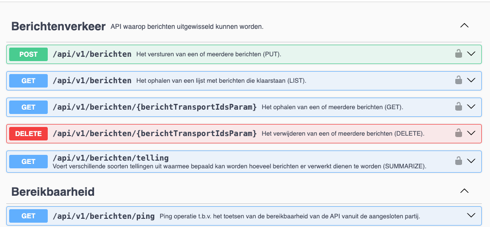

# BRP Berichten API

Deze repository bevat de OpenAPI Specificatie van de BRP Berichten API en andere informatie over deze voorziening voor
berichtuitwisseling, zoals het JSON Schema voor persoonsgegevens.

## Uitgangspunten voor de BRP Berichten API

- Qua berichtuitwisseling en berichtcycli dicht blijven bij het Logisch Ontwerp BRP.
- Berichtuitwisseling via RESTful API.
- Berichtinhoud in JSON.
- Text-encoding UTF-8.

## Specificaties

### OpenAPI specificaties

De OpenAPI specificatie van deze API is opgenomen in deze repository [in de OAS folder](./OAS/). Daarnaast kunt u
gebruik maken van de grafische weergave van de OpenAPI
specificatie:

* https://brp-berichten-api.dictua.ictu-sr.nl/swagger-ui/index.html

De BRP Berichten API is op dit moment in ontwikkeling. Dit betekent dat de mogelijkheden en het koppelvlak in beweging
zijn. De bestanden in deze repository zullen regelmatig een update krijgen de komende maanden. De OpenAPI specificatie
bevat een wijzigingshistorie zodat u kunt zien welke wijzigingen er plaatsgevonden hebben.

### JSON Schema's

Zowel de structuur van de persoonslijst als de berichtformaten zullen vastgelegd dan worden in JSON-Schema's. Zodra deze
beschikbaar zijn worden deze opgenomen in deze repository.

## Demo omgeving

Vooruitlopend op een ketentest-omgeving (LAP) is er een demo-omgeving beschikbaar gesteld welke gebruikt kan worden om
in een vroeger stadium een client-implementatie op te beproeven. Enkele kenmerken van de dem-omgeving zijn:

* Om gebruik te maken van de demo-omgeving dient u over inloggegevens te beschikken. Deze kunt u onder vermelding van uw
  organisatienaam opvragen door een e-mail naar een van de contactpersonen te sturen (zie onderaan dit artikel).

* U kunt inloggen op elk willekeurig account. Daarmee kunt u berichten verzenden van account A om vervolgens met account
  B het bericht te kunnen ontvangen. Op die manier kunt u uw eigen testbericht(en) inschieten e.d.
    * U kunt ook gebruik maken van accounts die andere in gebruik hebben. **_Beschouw deze demo-omgeving dus als
      onveilig en stuur nooit gevoelige informatie in._**
* De demo-omgeving is geen ketentest-omgeving. Ga er dus niet vanuit dat er berichten daadwerkelijk ontvangen worden
  door andere partijen.
* De demo-omgeving wordt regelmatig voorzien van updates vanuit het ontwikkelplatform. Wij behouden ons het recht om
  data verloren te laten gaan bij een update (reset van de database).

De demo-omgeving is benaderbaar via de volgende url:

* Base URL van de API: https://brp-berichten-api.dictua.ictu-sr.nl/api/v1/berichten
  

## Contactpersonen

Voor meer informatie en/of hulpvragen, kunt u contact opnemen met de onderstaande contactpersonen.

* [s.renkens@dictu.nl](mailto:s.renkens@dictu.nl) - Sebastiaan Renkens
* [maarten.woldring@dictu.nl](mailto:maarten.woldring@rvig.nl) - Maarten Woldring

