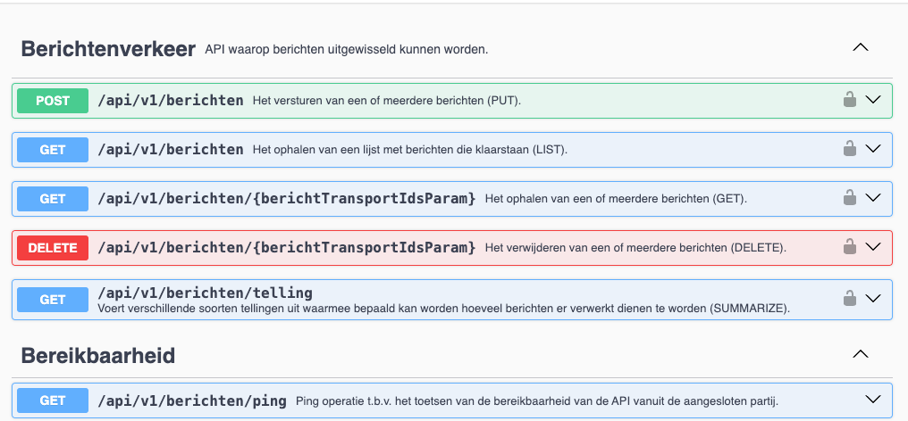

# BRP Berichten API

Deze repository bevat de OpenAPI Specificatie van de BRP Berichten API en andere informatie over deze voorziening voor
berichtuitwisseling, zoals het JSON Schema voor persoonsgegevens.

Uitgebreide toelichting en uitleg over deze API en de concepten die binnen deze API van toepassing zijn, zijn terug te vinden op: https://developer.rvig.nl/brp-berichten-api/

## OpenAPI specificaties

De OpenAPI specificatie van deze API is opgenomen in deze repository [in de openapi-specificatie folder](./openapi-specificatie/). Daarnaast kunt u
gebruik maken van de grafische weergave van de OpenAPI
specificatie:

* Redoc:
    * https://brp-berichten-api.dictua.ictu-sr.nl/openapi/berichten-api.html

De OpenAPI specificatie bevat een wijzigingshistorie zodat u kunt zien welke wijzigingen er plaatsgevonden hebben.

## De API beproeven

Vooruitlopend op een proef-/ketentest-omgeving (LAP) is er een demo-omgeving beschikbaar gesteld welke gebruikt kan worden om
in een vroeger stadium een client-implementatie op te beproeven.

Kom meer te weten over het aansluiten op deze demo-omgeving, maar ook andere omgevingen op: https://developer.rvig.nl/brp-berichten-api/aansluiten/brp-berichten-api/

## Berichtconversie API

Om voor u de transitie naar de nieuwe JSON-structuur te bespoedigen, kunt u gebruik maken van conversie endpoint welke
berichten voor u kan converteren tussen 'oud' en 'nieuw' formaat.

Lees verder op: https://developer.rvig.nl/brp-berichten-api/handleiding/berichten-converteren/

## Contactpersonen

Voor meer informatie en/of hulpvragen, kunt u contact opnemen via het onderstaande e-mailadres.
* [info@rvig.nl](mailto:info@rvig.nl)
